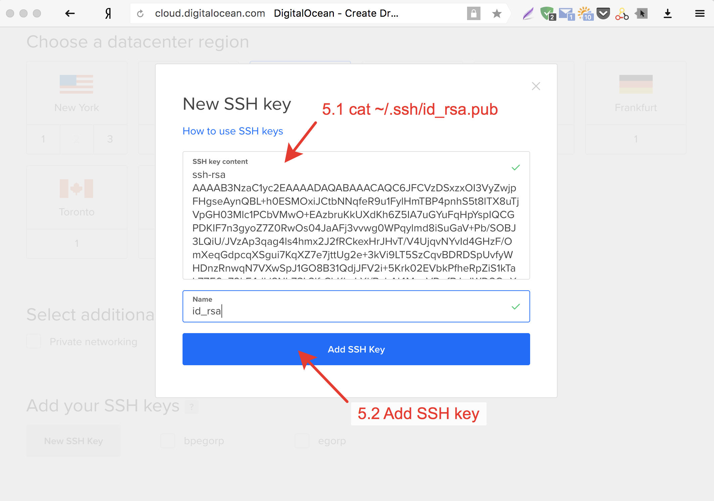

# SOCKS5 прокси для Telegram

Инструкция как поднять свой прокси-сервер (не VPN) для обхода блокировки Telegram. Стоит 5$ в месяц.

Telegram умеет использовать socks5 проксирование на уровне приложения. На мой взгляд это удобнее чем VPN. При настройке VPN у вас обычно (если не плясать с бубном) весь ваш трафик начинает идти через VPN-сервер. Это неудобно, медленно и избыточно.

Результатом данной инструкции будет ссылка вида ```tg://socks?server=167.99.39.89&port=1080&user=proxy&pass=MyLongPass123``` . Её достаточно открыть в любом приложении Telegram, чтобы оно снова заработал. Полученную ссылку можно переслать друзьям и родственникам.


_*Данная инструкция предоставляется исключительно в исследовательских целях и не призывает нарушать никакие из принятых законов._

_**Предполагается что у вас компьютер с MacOS или Linux и у вас есть пара (публичный и приватный) ключей для беспарольной авторизации по SSH._

### 1. Создаем виртуальный сервер на DigitalOcean

##### 1.0. Регистрируемся 

Регистрируемся, например по вот такой (моей) реферальной ссылке https://m.do.co/c/f5597999dfc3.

##### 1.1. Идем на вкладку Droplets


##### 1.2. Переходим к разделу One-click apps

Выбираем Docker.


##### 1.3. Выбираем размер сервера

Нам достаточно самого маленького, который стоит 5$ в месяц.


##### 1.4. Выбираем регион размещения сервера.

Мне нравится Амстердам, но можно выбрать любой другой.

После этого нажимаем на New SSH Key, чтобы добавить ваш ssh ключ.


Если у вас нет ключа, вот хорошая инструкция, как его создать https://help.github.com/articles/generating-a-new-ssh-key-and-adding-it-to-the-ssh-agent/.

##### 1.5. Добавляем SSH ключ

В поле SSH key content нужно вставить содержимое публичной части SSH ключа. Обычно оно находится в файле ~/.ssh/id_rsa.pub.

Получить его можно набрав в консоли

~~~shell
cat ~/.ssh/id_rsa.pub
~~~

Получим примерно следующее

~~~
ssh-rsa AAAAB3NzaC1yc2EAAAADAQABAAACAQC6JFCVzDSxzxOI3VyZwjpFHgseAynQBL+h0ESMOxiJCtbNNqfeR9u1FylHmT
.......
A8suhBfLgLi32PEMvM6Onm0Rs1tQBz5P+D9qa09y5UvgJ40n4pEg0j7sLjD2JcaVfCASINB6zvWZL9zK+aoQ== my@email.com
~~~


Полученный результат вставляем в окно в браузере.





##### 1.6. Создаем сервер

Жмем большую зеленую кнопку Create


Примерно через минуту новый сервер будет создан.

##### 1.7. Получаем ip нового сервера


Отлично!

Теперь у нас есть виртуальный сервер, на котором осталось настроить совсем немного. 


### 2. Запускаем SOCKS5 сервер

##### 2.1. Логинимся на сервер

~~~shell
ssh root@167.99.39.89
~~~

В вашем случае ip будет другим.

##### 2.2. Собираем контейнер и запускаем прокси-сервер

Клонируем этот репозиторий и запускаем сервис danted внутри контейнера. Вся необходимая настройка будет произведена автоматически при сборке контейнера.

~~~
git clone https://github.com/EgorP/telegram-socks-proxy.git && \
    cd telegram-socks-proxy/ && \
    docker-compose build && \
    docker-compose up -d
~~~


Результатом это команды будет примерно 30 строк текста. Среди них нам интересен кусок примерно такого содержания.

~~~
==========
Paste in telegram and click link below:

tg://socks?server=167.99.39.89&port=1080&user=proxy&pass=MyLongPass123

==========
~~~


В вашем случае она будет отличаться. Именно её нужно скопировать в любой telegram-чатик  (например в избранное) и кликнуть. Или просто открыть в браузере.

Появляется вот такое окно:


Нажимаем ок и у нас снова работает Telegram.


*При сборке контейнера будет создан случайный сложный пароль. Он фигурирует в ссылке. Это гарантия того, что вашим прокси сервером смогут пользоваться только те, кому вы отправили эту ссылку.*

